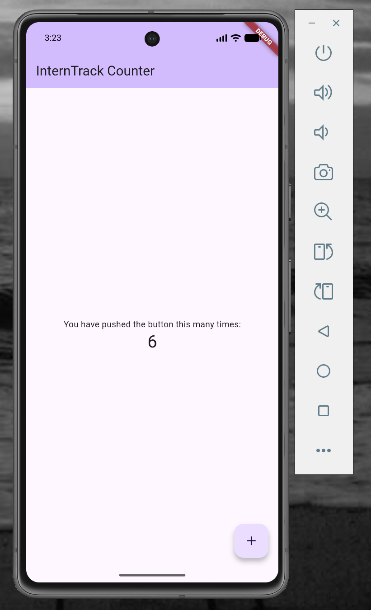
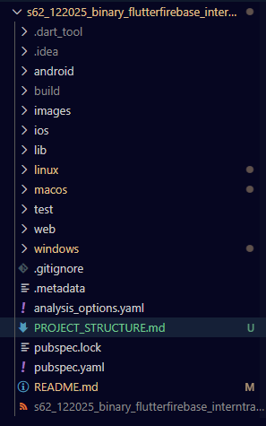
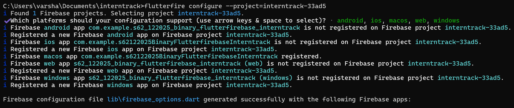
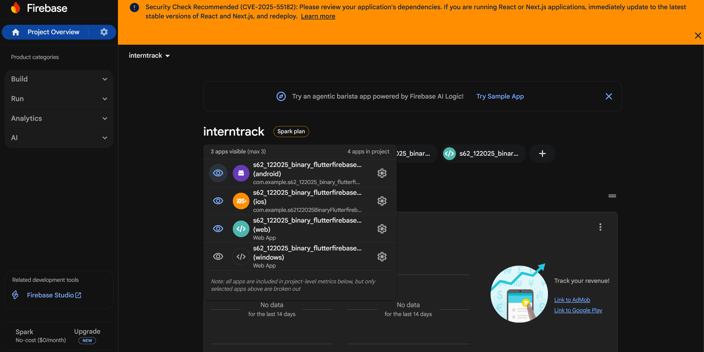
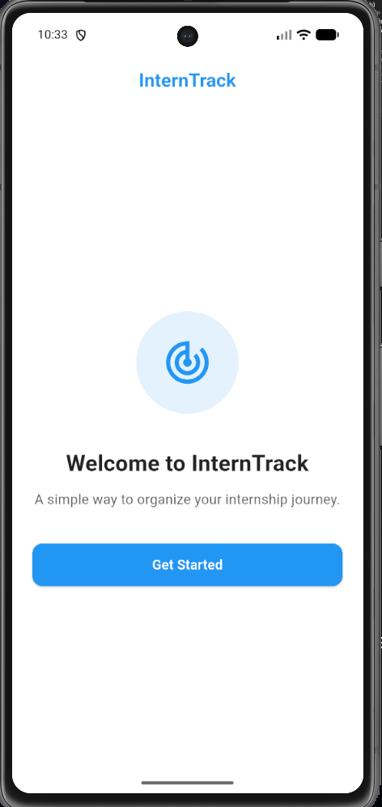
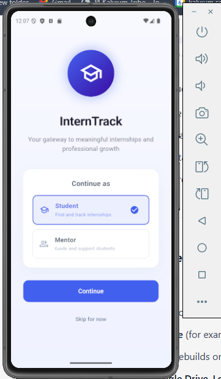
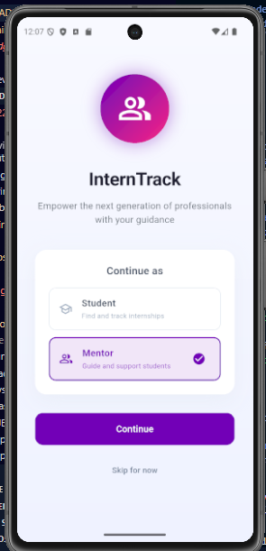
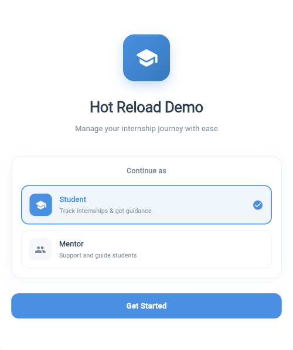
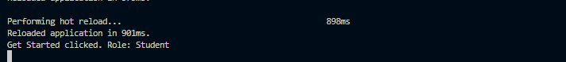
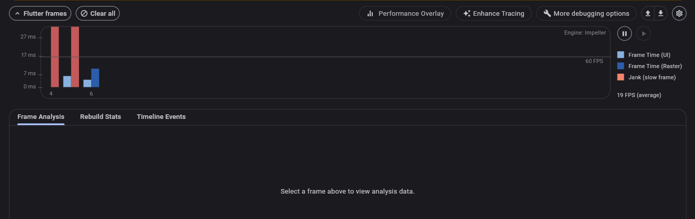

       # InternTrack

## Problem Statement
College students struggle to track internship applications and mentorship feedback across multiple platforms. What kind of unified portal could streamline this process?

---

## Overview
**InternTrack** is a mobile-first application designed to centralize internship tracking and mentorship interactions into a single, structured platform. The app enables students to manage internship applications, monitor progress, and receive mentor feedback in real time—eliminating the need to juggle emails, job portals, and messaging apps.

InternTrack focuses on clarity, organization, and accessibility, helping students stay on top of their career development journey with minimal friction.

---

## Key Features
- Centralized internship application tracking  
- Real-time status updates and progress monitoring  
- Structured mentor feedback and help requests  
- Secure, role-based access for students and mentors  
- Document uploads for resumes and profiles  
- Clean, responsive, mobile-first user interface  

---

## Target Users
- **College Students** – managing multiple internship applications and mentorship interactions  
- **Mentors** – providing structured, private feedback to assigned students  

---

## Solution Highlights
- **Single Unified Dashboard**: View internships, statuses, deadlines, and feedback in one place  
- **Real-Time Data Sync**: Updates reflect instantly without manual refresh  
- **Private Mentor Collaboration**: Invite-only mentor access ensures security and relevance  
- **Scalable Architecture**: Designed to grow with increasing users and data  

---

## Tech Stack

### Frontend
- **Flutter** – Cross-platform UI framework
- **Dart** – Strongly typed, reactive programming language

### Backend & Services
- **Firebase Authentication** – Secure user sign-up and login
- **Cloud Firestore** – Real-time NoSQL database
- **Firebase Storage** – Secure file uploads and document handling

---

## Core App Components
- Authentication (Sign Up, Login, Logout)
- Student Dashboard (Internship tracking)
- Mentor Dashboard (Feedback & guidance)
- Internship CRUD operations
- Profile & document management
- Real-time database integration

---

## Functional Capabilities
- Add, update, and delete internship applications  
- Assign mentors through a private invitation system  
- Submit and view mentor feedback securely  
- Upload and access resumes/documents  
- Real-time updates across all user actions  

---

## Non-Functional Focus
- Fast UI interactions (under 200 ms)
- Secure data access with enforced rules
- Responsive layouts across device sizes
- Reliable real-time synchronization

---

## How to Run the Project
```bash
flutter pub get
flutter run
```

---

## Vision
InternTrack aims to simplify and structure the internship and mentorship experience by bringing fragmented workflows into a single, intuitive platform—empowering students to focus on growth rather than coordination.

---


 # Flutter Environment Setup and First App Run

## Steps Followed

### 1. Flutter SDK Installation
- Downloaded the Flutter SDK from the official Flutter website
- Extracted the SDK and added `flutter/bin` to the system PATH
- Verified the installation using:
  ```bash
  flutter doctor```

### 2. Development Environment Setup

- Installed Android Studio
- Ensured Android SDK, Android Platform Tools, and Android Virtual Device (AVD) Manager were installed
- Installed Flutter and Dart plugins in Android Studio
- Set up VS Code with Flutter and Dart extensions for development

### 3. Emulator Configuration

- Opened Android Studio and accessed the Device Manager
- Created a virtual device using a Pixel series phone model
- Selected an Android system image (Android 13 or above)
- Launched the emulator successfully
Verified emulator detection using:

``` flutter devices```

### 4. First Flutter App Execution

- Created a new Flutter project using:

```flutter create .```
- Ran the default Flutter counter application using:

```flutter run```

- Successfully launched the application on the Android emulator

# Setup Verification

## Flutter Doctor Output

The following screenshot confirms a healthy Flutter setup with all required dependencies installed:


---

## Flutter App Running on Emulator

The screenshot below shows the default Flutter application running successfully on the Android emulator:


---

## Reflection

During the setup process, I faced challenges related to emulator configuration, Gradle dependency downloads, and Android device detection. Troubleshooting these issues helped me better understand how Flutter integrates with Android tooling and the importance of correct environment setup. Completing this process has prepared me to efficiently build, test, and debug Flutter applications across devices in upcoming sprint tasks.

---

## Conclusion

The Flutter SDK, Android Studio, and Android emulator have been successfully configured, and the first Flutter application has been executed on an emulator. This confirms that the development environment is ready for further Flutter UI development and Firebase integration in subsequent sprint deliverables.

---

# Exploring Flutter & Dart Fundamentals for Cross-Platform UI Development

### Objective
To understand Flutter’s architecture, widget-based UI system, and Dart language fundamentals for creating interactive, reactive, and visually consistent mobile interfaces.

---

## Flutter Architecture
Flutter is built on a layered architecture that ensures high performance and consistent UI across platforms.

### Core Layers of Flutter

- **Framework Layer (Dart):**  
  Written entirely in Dart. This layer provides Material and Cupertino widgets, rendering, animation libraries, and gesture handling.

- **Engine Layer (C++):**  
  Built using C++. It handles rendering through the Skia graphics engine, text layout, and communication with the underlying platform via platform channels.

- **Embedder Layer:**  
  Integrates Flutter with platform-specific APIs such as Android, iOS, web, Windows, macOS, and Linux.

**Key Idea:**  
Flutter does not rely on native UI components. Instead, it renders everything itself using the Skia engine, ensuring pixel-perfect consistency across all platforms.

---

## Widget Tree in Flutter
In Flutter, everything is a widget. The UI is composed as a hierarchical widget tree.

### Types of Widgets

- **StatelessWidget:**  
  Used for static UI elements that do not change over time (e.g., labels, icons).

- **StatefulWidget:**  
  Used for dynamic UI elements that update when user interaction or data changes (e.g., counters, forms).

### Example Widget Structure
    MaterialApp  
    └── Scaffold  
        ├── AppBar  
        └── Column  
            ├── Text  
            └── FloatingActionButton  

Hot Reload allows instant UI updates without restarting the app.

---

## Dart Language Essentials
Dart is a modern, object-oriented, and strongly typed language optimized for UI development.

### Core Dart Concepts

- Classes and Objects  
- Type Inference  
- Null Safety  
- Async and Await  

These features make Dart ideal for Flutter’s reactive programming model.

---

## Reactive UI with setState()
Flutter follows a reactive UI paradigm. When the state changes, Flutter rebuilds only the affected widgets.

Using `setState()`:
- Notifies Flutter that data has changed
- Triggers an efficient UI re-render
- Ensures smooth and responsive user interactions

---

## Screenshots
Screenshots of the running Flutter app and the counter interaction below.



---

## Project Structure Overview

The Flutter project follows a modular and scalable folder structure.  
Detailed explanations of each folder and file can be found in [PROJECT_STRUCTURE.md](PROJECT_STRUCTURE.md).

---

### Folder Structure



## Reflection on Folder Structure

Understanding the role of each Flutter folder helps maintain clean and organized code. A clear structure makes collaboration easier by allowing team members to work on separate features without conflicts.


---

## Flutter & Dart Basics


### Folder Structure

```
lib/
├── main.dart
├── screens/
├── widgets/
├── models/
├── services/
```

**Directory Explanation**
- **main.dart**: Entry point of the application that initializes the app and loads the first screen.
- **screens/**: Contains complete UI screens/pages of the app.
- **widgets/**: Reusable UI components shared across multiple screens.
- **models/**: Data structures representing core app entities.
- **services/**: Handles business logic and backend/service interactions (Firebase in later sprints).

This structure supports modular design and makes the application easier to scale and maintain.

---

### Setup Instructions

To run the project locally:

```bash
flutter pub get
flutter run
```

---

### Reflection

This task helped me understand Flutter’s widget-based architecture and how Dart enables reactive UI updates using state management. Organizing the project into screens, widgets, models, and services clarified how complex Flutter applications are built and maintained, which will help significantly in future sprints.

---


## Firebase Integration Using FlutterFire CLI

This section documents **Integrating Firebase SDKs Using FlutterFire CLI and Packages**. The objective of this unit was to connect the existing Flutter project to Firebase using the official FlutterFire CLI and prepare the application for authentication, database, and storage services in a cross-platform manner.


#### 1. Firebase Project & CLI Setup
- Ensured an existing Firebase project was available in Firebase Console
- Installed required tools:
  ```bash
  npm install -g firebase-tools
  dart pub global activate flutterfire_cli
  ```
- Verified FlutterFire CLI installation:
  ```bash
  flutterfire --version
  ```

#### 2. Firebase Authentication (CLI Login)
- Logged into Firebase using:
  ```bash
  firebase login
  ```
- Used the same Google account associated with the Firebase project

#### 3. FlutterFire CLI Configuration
- Ran the following command inside the Flutter project root:
  ```bash
  flutterfire configure
  ```
- Selected the correct Firebase project when prompted
- Allowed FlutterFire CLI to auto-detect platforms (Android by default)

This process automatically generated:
- `lib/firebase_options.dart`
- `firebase.json`
- Platform-specific Firebase configuration files

This eliminated the need for manual Firebase setup and ensured consistency across platforms.

---

### 4. Firebase Initialization in Flutter
The application entry point was updated to initialize Firebase using the generated configuration:

```dart
import 'package:flutter/material.dart';
import 'package:firebase_core/firebase_core.dart';
import 'firebase_options.dart';

void main() async {
  WidgetsFlutterBinding.ensureInitialized();
  await Firebase.initializeApp(
    options: DefaultFirebaseOptions.currentPlatform,
  );
  runApp(const InternTrackApp());
}
```

This confirms that Firebase is correctly initialized for the current platform at runtime.

---

### 5. Adding Firebase SDK Packages
The following Firebase packages were added to support upcoming features:

```yaml
  firebase_core: ^4.3.0
  firebase_auth: ^6.1.3          
  cloud_firestore: ^6.1.1     
  firebase_storage: ^13.0.5
```

Dependencies were installed using:
```bash
flutter pub get
```

These SDKs are now ready to be used for:
- User authentication
- Real-time database operations
- Media and file storage

---

### 6. Verification
- Ran the application using:
  ```bash
  flutter run
  ```
- Confirmed successful build and launch on Android emulator
- Verified Firebase initialization logs in the terminal
- Confirmed the app appears under **Firebase Console → Project Settings → Your Apps**

---

## Screenshots

1. **FlutterFire CLI Configuration**
   - Terminal output showing successful execution of:
     ```bash
     flutterfire configure
     ```
     
     

2. **Generated Firebase Files**
   - VS Code view showing:
     - `lib/firebase_options.dart`
     - `firebase.json`

3. **Firebase Console Verification**
   - Firebase Console screenshot showing the registered Android app
   

4. **Running Application**
   - App running successfully on the Android emulator after Firebase initialization
   

---

## Reflection

Using FlutterFire CLI significantly simplified Firebase integration by automating configuration steps that are otherwise error-prone when done manually. The CLI-based approach ensures cross-platform readiness and maintains consistent SDK versions across environments. This setup provides a strong backend foundation for implementing authentication, real-time data synchronization, and storage features in upcoming units.

---

## Understanding the Widget Tree and Flutter's Reactive UI Model

### Project Description
This demo focuses on the **InternTrack Welcome Screen**, built using Flutter to demonstrate the **widget tree structure** and **reactive UI model**. The screen allows users to toggle between *Student* and *Mentor* roles, with the UI updating automatically based on state changes.

---

### Widget Tree Hierarchy
The Welcome Screen UI is composed of nested widgets arranged in a hierarchical widget tree:

```text
MaterialApp
└── WelcomeScreen
    └── Scaffold
        └── Container (Background)
            └── Center
                └── Padding
                    └── Column (Main Content)
                        ├── AnimatedContainer (Icon with Gradient)
                        ├── Text (App Title)
                        ├── Text (Description)
                        ├── Container (Role Selection Card)
                        │   └── Column
                        │       ├── Text ("Continue as")
                        │       ├── ListTile (Student Option)
                        │       └── ListTile (Mentor Option)
                        ├── ElevatedButton (Continue)
                        └── TextButton (Skip)

```

This structure shows clear parent–child relationships between widgets.

---

### Reactive UI Behavior
- A boolean state variable controls the displayed role (Student / Mentor)
- Pressing the button triggers `setState()`
- Flutter automatically rebuilds only the affected widgets

### Before State Change


### After State Change


---

## Concept Explanation

### What is a Widget Tree?
In Flutter, everything is a widget. Widgets are arranged hierarchically in a widget tree where each widget is a node that defines part of the UI.

### How does Flutter’s reactive model work?
Flutter follows a reactive UI model where changes in application state automatically trigger UI updates using `setState()` without manual redrawing.

### Why does Flutter rebuild only parts of the UI?
Flutter efficiently rebuilds only the widgets affected by state changes instead of the entire screen, resulting in better performance and smoother UI updates.

---

## Reflection
Understanding the widget tree and Flutter’s reactive UI model made it easier to design the InternTrack welcome screen efficiently. This approach supports scalable UI development and smooth collaboration when multiple developers work on different features.

---

# Firebase Authentication (Email & Password)

## Overview
This part of the InternTrack project implements **Firebase Authentication using Email & Password** in a Flutter application.  
Firebase Auth provides a secure, scalable, and backend-free solution for handling user signups, logins, and session management.

By completing this task, the app now allows users to:
- Register a new account using email & password
- Log in securely
- Maintain authentication state across app restarts
- Log out safely
- Verify user presence in the Firebase Console

---

## Tech Stack
- **Flutter**
- **Firebase Authentication**
- **Firebase Core**
- **FlutterFire CLI**

---

## Features Implemented
- Email & Password **Signup**
- Email & Password **Login**
- Authentication state handling using `authStateChanges()`
- Secure **Logout**
- Error handling for common authentication issues
- Firebase Console verification of registered users

---

## Setup Instructions

### 1️.Enable Firebase Authentication
1. Go to **Firebase Console**
2. Navigate to **Authentication → Sign-in method**
3. Enable **Email/Password**
4. Click **Save**

---

### 2️. Add Dependencies
```yaml
dependencies:
  firebase_core: ^3.0.0
  firebase_auth: ^5.0.0
```

Run:
```bash
flutter pub get
```

---

### 3️.Initialize Firebase
Firebase is initialized before running the app:

```dart
void main() async {
  WidgetsFlutterBinding.ensureInitialized();
  await Firebase.initializeApp(
    options: DefaultFirebaseOptions.currentPlatform,
  );
  runApp(InternTrackApp());
}
```

---

## Authentication Logic

### Signup
```dart
await FirebaseAuth.instance.createUserWithEmailAndPassword(
  email: email,
  password: password,
);
```

### Login
```dart
await FirebaseAuth.instance.signInWithEmailAndPassword(
  email: email,
  password: password,
);
```

### Logout
```dart
await FirebaseAuth.instance.signOut();
```

### Authentication State Handling
```dart
FirebaseAuth.instance.authStateChanges()
```

This ensures:
- Logged-in users are redirected to **HomeScreen**
- Logged-out users are redirected to **WelcomeScreen**

---

## Verification
After successful signup/login:
1. Open **Firebase Console**
2. Go to **Authentication → Users**
3. Verify that the user email appears in the list

---

## Common Errors Handled
| Error | Cause | Handling |
|-----|------|---------|
| Invalid email | Wrong format | Validation + Firebase error |
| Weak password | < 6 characters | Manual validation |
| User not found | Email not registered | Firebase error handling |
| Wrong password | Incorrect password | Firebase error handling |
| Firebase not initialized | Missing setup | Firebase initialized in `main.dart` |

---

## Reflection

### How does Firebase simplify authentication?
Firebase eliminates the need to build and manage a custom authentication backend. It handles:
- Secure credential storage
- Token management
- Session persistence
- Cross-platform authentication

### What security features make it better than custom auth?
- Industry-standard encryption
- Secure token-based sessions
- Built-in protection against common auth vulnerabilities
- Backend managed by Google

### Challenges Faced
- Understanding authentication state handling
- Managing navigation after login/logout
- Handling FirebaseAuthException cases cleanly

---

#  Hot Reload, Debug Console & DevTools Demo

## Project Overview
This demo is part of Sprint-2 and showcases the use of **Flutter Hot Reload**, the **Debug Console**, and **Flutter DevTools** using the InternTrack Flutter application. The goal is to understand how these tools improve development speed, debugging, and UI inspection while building a reactive Flutter app.

The demonstration is performed on the **Welcome Screen**, which allows users to select a role (Student or Mentor) and navigate forward.

---

## Steps Performed

### 1. Hot Reload
- Ran the Flutter app in debug mode using `flutter run`.
- Modified a text widget on the Welcome Screen.
- Saved the file to trigger Hot Reload.
- Observed instant UI updates without restarting the app or losing state.

### 2. Debug Console
- Added a `debugPrint()` statement to the **Get Started** button.
- Interacted with the app by clicking the button.
- Verified runtime log output in the Debug Console.

### 3. Flutter DevTools
- Opened Flutter DevTools from VS Code while the app was running.
- Explored the **Widget Inspector** to visualize the widget tree.
- Inspected UI elements to understand widget hierarchy and structure.

---

## Screenshots

### Hot Reload in Action


### Debug Console Output


### Flutter DevTools – Widget Inspector

---

## Reflection

### How does Hot Reload improve productivity?
Hot Reload allows developers to instantly see UI changes without restarting the app, which significantly speeds up development and UI iteration.

### Why is DevTools useful for debugging and optimization?
Flutter DevTools provides visual tools like the Widget Inspector and performance graphs, helping developers understand widget structure, detect issues, and optimize app performance.

### How can these tools be used in a team workflow?
In a team environment, these tools help developers debug faster, maintain consistent UI behavior, quickly review changes, and collaborate efficiently without repeated app restarts.

---

## Conclusion
This exercise demonstrates how Flutter’s development tools enable fast iteration, effective debugging, and better understanding of the reactive UI model, making them essential for building scalable applications like InternTrack.


## Firebase Authentication Flow (Signup, Login & Logout)

This section extends the existing application by implementing a complete Firebase Authentication flow using **Firebase Auth** in Flutter. The goal of this implementation is to handle user authentication securely and seamlessly, similar to a real-world production app.

---

### Features Implemented

- **User Sign Up**
  - New users can create an account using email and password.
  - Implemented using `createUserWithEmailAndPassword()`.
  - Validations for empty fields, invalid email, and weak passwords.
  - Errors are displayed using SnackBars.

- **User Login**
  - Existing users can log in using registered credentials.
  - Implemented using `signInWithEmailAndPassword()`.
  - Handles common authentication errors such as:
    - Wrong password
    - User not found
    - Invalid email

- **Authentication State Handling**
  - The app listens to authentication state changes using:
    ```dart
    FirebaseAuth.instance.authStateChanges()
    ```
  - Based on the auth state:
    - Logged-in users are shown the **HomeScreen**
    - Logged-out users are shown the **AuthScreen**
  - This ensures automatic navigation without manual routing after login or logout.

- **Logout**
  - Users can securely log out using:
    ```dart
    FirebaseAuth.instance.signOut();
    ```
  - On logout, the session is cleared and the app automatically redirects back to the authentication screen.

- **Splash Screen**
  - A custom animated splash screen is shown on app launch.
  - After the splash animation, the app transitions to the authentication flow.

---

### End-to-End Flow

1. User launches the app → Splash screen is displayed
2. App checks authentication state
3. If user is authenticated → HomeScreen is shown
4. If user is not authenticated → AuthScreen is shown
5. User can:
   - Sign up → redirected automatically to HomeScreen
   - Log in → redirected automatically to HomeScreen
   - Log out → redirected automatically to AuthScreen

---

### Key Learning

- `authStateChanges()` simplifies navigation by reacting to real-time authentication updates.
- No manual navigation is required after login or logout.
- Firebase Authentication securely manages user sessions across app restarts.

---

### Reflection

- **Hardest part:** Managing authentication states without manual navigation.
- **How StreamBuilder helps:** It rebuilds the UI automatically when auth state changes.
- **Why logout is important:** It clears the session and prevents unauthorized access.

---

