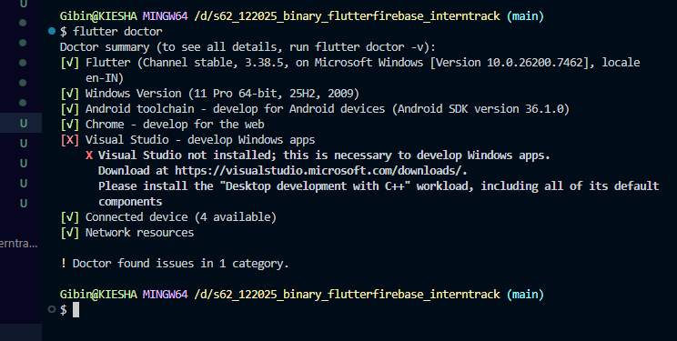
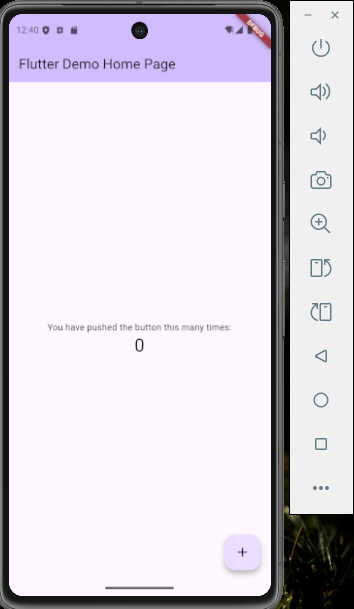

       # InternTrack

## Problem Statement
College students struggle to track internship applications and mentorship feedback across multiple platforms. What kind of unified portal could streamline this process?

---

## Overview
**InternTrack** is a mobile-first application designed to centralize internship tracking and mentorship interactions into a single, structured platform. The app enables students to manage internship applications, monitor progress, and receive mentor feedback in real time—eliminating the need to juggle emails, job portals, and messaging apps.

InternTrack focuses on clarity, organization, and accessibility, helping students stay on top of their career development journey with minimal friction.

---

## Key Features
- Centralized internship application tracking  
- Real-time status updates and progress monitoring  
- Structured mentor feedback and help requests  
- Secure, role-based access for students and mentors  
- Document uploads for resumes and profiles  
- Clean, responsive, mobile-first user interface  

---

## Target Users
- **College Students** – managing multiple internship applications and mentorship interactions  
- **Mentors** – providing structured, private feedback to assigned students  

---

## Solution Highlights
- **Single Unified Dashboard**: View internships, statuses, deadlines, and feedback in one place  
- **Real-Time Data Sync**: Updates reflect instantly without manual refresh  
- **Private Mentor Collaboration**: Invite-only mentor access ensures security and relevance  
- **Scalable Architecture**: Designed to grow with increasing users and data  

---

## Tech Stack

### Frontend
- **Flutter** – Cross-platform UI framework
- **Dart** – Strongly typed, reactive programming language

### Backend & Services
- **Firebase Authentication** – Secure user sign-up and login
- **Cloud Firestore** – Real-time NoSQL database
- **Firebase Storage** – Secure file uploads and document handling

---

## Core App Components
- Authentication (Sign Up, Login, Logout)
- Student Dashboard (Internship tracking)
- Mentor Dashboard (Feedback & guidance)
- Internship CRUD operations
- Profile & document management
- Real-time database integration

---

## Functional Capabilities
- Add, update, and delete internship applications  
- Assign mentors through a private invitation system  
- Submit and view mentor feedback securely  
- Upload and access resumes/documents  
- Real-time updates across all user actions  

---

## Non-Functional Focus
- Fast UI interactions (under 200 ms)
- Secure data access with enforced rules
- Responsive layouts across device sizes
- Reliable real-time synchronization

---

## How to Run the Project
```bash
flutter pub get
flutter run
```

---

## Vision
InternTrack aims to simplify and structure the internship and mentorship experience by bringing fragmented workflows into a single, intuitive platform—empowering students to focus on growth rather than coordination.

---


 # Flutter Environment Setup and First App Run

## Steps Followed

### 1. Flutter SDK Installation
- Downloaded the Flutter SDK from the official Flutter website
- Extracted the SDK and added `flutter/bin` to the system PATH
- Verified the installation using:
  ```bash
  flutter doctor```

### 2. Development Environment Setup

- Installed Android Studio
- Ensured Android SDK, Android Platform Tools, and Android Virtual Device (AVD) Manager were installed
- Installed Flutter and Dart plugins in Android Studio
- Set up VS Code with Flutter and Dart extensions for development

### 3. Emulator Configuration

- Opened Android Studio and accessed the Device Manager
- Created a virtual device using a Pixel series phone model
- Selected an Android system image (Android 13 or above)
- Launched the emulator successfully
Verified emulator detection using:

``` flutter devices```

### 4. First Flutter App Execution

- Created a new Flutter project using:

```flutter create .```
- Ran the default Flutter counter application using:

```flutter run```

- Successfully launched the application on the Android emulator

# Setup Verification

## Flutter Doctor Output

The following screenshot confirms a healthy Flutter setup with all required dependencies installed:



---

## Flutter App Running on Emulator

The screenshot below shows the default Flutter application running successfully on the Android emulator:



---

## Reflection

During the setup process, I faced challenges related to emulator configuration, Gradle dependency downloads, and Android device detection. Troubleshooting these issues helped me better understand how Flutter integrates with Android tooling and the importance of correct environment setup. Completing this process has prepared me to efficiently build, test, and debug Flutter applications across devices in upcoming sprint tasks.

---

## Conclusion

The Flutter SDK, Android Studio, and Android emulator have been successfully configured, and the first Flutter application has been executed on an emulator. This confirms that the development environment is ready for further Flutter UI development and Firebase integration in subsequent sprint deliverables.
